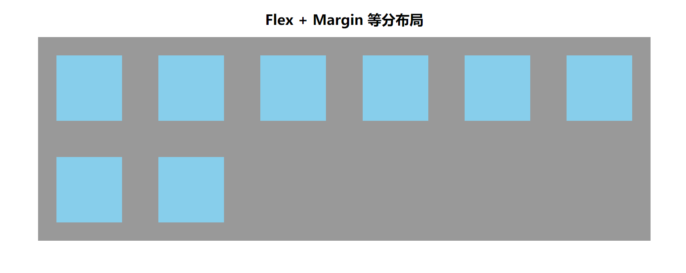
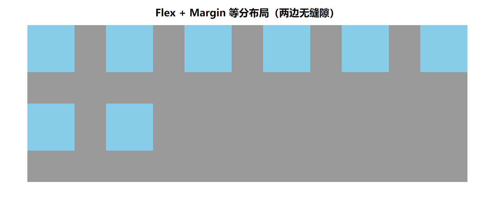

<!-- # CSS 小知识 -->

## 1、排版

### 1.1 文本溢出

1. 单行文本省略

```css
.text-ellipsis {
  overflow: hidden;
  text-overflow: ellipsis;
  white-space: nowrap;
}
```

2. 多行文本省略

```css
.text-ellipsis-more {
  overflow: hidden;
  text-overflow: ellipsis;
  display: -webkit-box;
  -webkit-line-clamp: 2;
  /* 限制在一个块元素显示的文本的行数 */
  -webkit-box-orient: vertical;
  /* 垂直排列 */
}
```

3. FlexBox 中单行文本省略（Tailwind CSS 为例）


```html
<div class="flex justify-between items-center">
  <div class="min-w-0 flex-1 flex">
    <p class="truncate">
      <span> [我是标题] </span>
      <span>我是超长的标题</span>
    </p>
  </div>
  <p class="ml-5 flex-shrink-0">2024-12-12</p>
</div>
```

注：`min-w-0`不可缺少

### 1.2 滤镜 の 全站灰白

```css
html,
body {
  filter: grayscale(1);
}
```

### 1.3 宽高

1.  内容适应宽度

```css
.content-adaptation-width {
  width: fit-content;
  width: -moz-fit-content; /* 兼容火狐 */
}
```

## 2、布局

### 2.1、等分布局 flex + margin



```html
<!DOCTYPE html>
<html lang="zh">
  <head>
    <meta charset="UTF-8" />
    <meta name="viewport" content="width=device-width, initial-scale=1.0" />
    <title>flex + margin 等分布局</title>
    <style>
      * {
        margin: 0;
        padding: 0;
        box-sizing: border-box;
      }
      header {
        text-align: center;
        margin: 40px 0 20px;
      }

      main {
        margin: 0 auto;
        width: 1400px;
        background-color: #999;
        display: flex;
        flex-wrap: wrap;
        align-items: flex-start;
        align-content: flex-start;
      }
      /* 主要代码 */
      main .item {
        --n: 6;
        --space: calc(100% - var(--n) * 150px);
        --h: calc(var(--space) / var(--n) / 2);
        width: 150px;
        height: 150px;
        margin: var(--h);
        /* end */
        background-color: skyblue;
      }
    </style>
  </head>
  <body>
    <header>
      <h1>Flex + Margin 等分布局</h1>
    </header>
    <main>
      <div class="item"></div>
      <div class="item"></div>
      <div class="item"></div>
      <div class="item"></div>
      <div class="item"></div>
      <div class="item"></div>
      <div class="item"></div>
      <div class="item"></div>
    </main>
  </body>
</html>
```

### 2.2、等分布局 flex + margin(两边无缝隙)



```html
<!DOCTYPE html>
<html lang="zh">
  <head>
    <meta charset="UTF-8" />
    <meta name="viewport" content="width=device-width, initial-scale=1.0" />
    <title>flex + margin 等分布局(两边无缝隙)</title>
    <style>
      * {
        margin: 0;
        padding: 0;
        box-sizing: border-box;
      }
      header {
        text-align: center;
        margin: 40px 0 20px;
      }

      main {
        margin: 0 auto;
        width: 1400px;
        background-color: #999;
        display: flex;
        flex-wrap: wrap;
        align-items: flex-start;
        align-content: flex-start;
      }
      /* 主要代码 */
      main .item {
        --n: 6;
        --space: calc(100% - var(--n) * 150px);
        --h: calc(var(--space) / calc(var(--n) - 1));
        width: 150px;
        height: 150px;
        margin-right: var(--h);
        margin-bottom: var(--h);
        /* end */
        background-color: skyblue;
      }
      main .item:nth-child(6n + 6) {
        margin-right: 0;
      }
    </style>
  </head>
  <body>
    <header>
      <h1>Flex + Margin 等分布局（两边无缝隙）</h1>
    </header>
    <main>
      <div class="item"></div>
      <div class="item"></div>
      <div class="item"></div>
      <div class="item"></div>
      <div class="item"></div>
      <div class="item"></div>
      <div class="item"></div>
      <div class="item"></div>
    </main>
  </body>
</html>
```

### 2.3、九宫格布局

> 每个元素宽高为 1:1 的九宫格布局
>
> 同时适用于：`PC`、`Uni-App`、`小程序`


- 方案一：`CSS`属性：`aspect-ratio`
  - 为盒子规定了首选纵横比，这个纵横比可以用于计算 auto 尺寸以及其他布局函数；
  - 设置为：`aspect-ratio: 1 / 1`；
- 方案二：`padding` + `absolute`
  - 设置`padding-top`或`padding-bottom`为`100%`，此时会按照宽度进行撑高包含块；
  - 子元素设置为`absolute`并撑满其包含块；

#### 1、aspect-ratio

```html
<!-- 样式 -->
<style>
  .list {
    display: grid;
    grid-template: 1fr 1fr 1fr / 1fr 1fr 1fr;
    gap: 20rpx;
  }
  .item {
    aspect-ratio: 1 / 1;
    background-color: #008c8c;
    display: flex;
    justify-content: center;
    align-items: center;
  }
</style>

<!-- 结构 -->
<div class="list">
  <div class="item">item-01</div>
  <div class="item">item-02</div>
  <div class="item">item-03</div>
  <div class="item">item-04</div>
  <div class="item">item-05</div>
  <div class="item">item-06</div>
  <div class="item">item-07</div>
  <div class="item">item-08</div>
  <div class="item">item-09</div>
</div>
```

#### 2、Padding + Absolute

```html
<!-- 样式 -->
<style>
  .list {
    display: grid;
    grid-template: 1fr 1fr 1fr / 1fr 1fr 1fr;
    gap: 20rpx;
  }
  .item {
    position: relative;
    padding-bottom: 100%;
  }
  .item-container {
    position: absolute;
    left: 0;
    right: 0;
    top: 0;
    bottom: 0;
    width: 100%;
    height: 100%;
    background-color: #008c8c;
    display: flex;
    justify-content: center;
    align-items: center;
  }
</style>

<!-- 结构 -->
<div class="list">
  <div class="item">
    <div class="item-container">item-01</div>
  </div>
  <div class="item">
    <div class="item-container">item-02</div>
  </div>
  <div class="item">
    <div class="item-container">item-03</div>
  </div>
  <div class="item">
    <div class="item-container">item-04</div>
  </div>
  <div class="item">
    <div class="item-container">item-05</div>
  </div>
  <div class="item">
    <div class="item-container">item-06</div>
  </div>
  <div class="item">
    <div class="item-container">item-07</div>
  </div>
  <div class="item">
    <div class="item-container">item-08</div>
  </div>
  <div class="item">
    <div class="item-container">item-09</div>
  </div>
</div>
```

## 3、媒体查询

```css
/* media-adaptation.css */
/* 媒体自适应 */

/* 小于 768px 《===》xs */
@media only screen and (max-width: 767px) {
  /* 在这里编写小于 768px 时应用的 CSS */
}

/* 大于等于 768px 《===》sm */
@media only screen and (min-width: 768px) {
  /* 在这里编写大于等于 768px 时应用的 CSS */
}

/* 大于等于 992px 《===》md */
@media only screen and (min-width: 992px) {
  /* 在这里编写大于等于 992px 时应用的 CSS */
}

/* 大于等于 1200px 《===》lg */
@media only screen and (min-width: 1200px) {
  /* 在这里编写大于等于 1200px 时应用的 CSS */
}

/* 大于等于 1920px 《===》xl */
@media only screen and (min-width: 1920px) {
  /* 在这里编写大于等于 1920px 时应用的 CSS */
}
```

## 4、特效

### 4.1、全屏滚动吸附

> 用途：企业官网

> 效果图


#### 4.1.1、原理解析

1. 父容器设置样式：`overflow-y: scroll;`、`scroll-snap-type: y mandatory;`
   - scroll-snap-type: `吸附轴(x/y)` `[吸附程度(mandatory)]`
   - mandatory: 超过距离则自动滚动到下一个容器
2. 子元素设置样式：`scroll-snap-align: start;`
   - 滚动容器中的一个临界点
   - start: 开始部分; end: 结束部分; center: 中间部分

#### 4.1.2、功能实现

- HTML 结构

```html
<div class="container">
  <div class="page page1">
    <h1>第一页</h1>
  </div>
  <div class="page page2">
    <h1>第二页</h1>
  </div>
  <div class="page page3">
    <h1>第三页</h1>
  </div>
  <div class="page page4">
    <h1>第四页</h1>
  </div>
</div>
```

- CSS 样式

```css
/* 滚动条样式 */
::-webkit-scrollbar-track-piece {
  border-radius: 6px;
  background: #0000001a;
}
::-webkit-scrollbar-thumb {
  border-radius: 6px;
  background: #c1c1c1;
}
::-webkit-scrollbar {
  width: 6px;
  height: 6px;
}
/* 滚动条样式 */
* {
  margin: 0;
  padding: 0;
}
.container {
  height: 100vh;
  overflow-y: scroll;
  /* scroll-snap-type: 吸附轴(x/y) [吸附程度(mandatory)] */
  /* mandatory: 超过距离则自动滚动到下一个容器 */
  scroll-snap-type: y mandatory;
}

.container .page {
  height: 100vh;
  /* 滚动容器中的一个临界点 */
  /* start: 开始部分; end: 结束部分; center: 中间部分*/
  scroll-snap-align: start;
}

.container .page h1 {
  font-size: 100px;
  text-align: center;
  color: #fff;
  line-height: 100vh;
}

.page1 {
  background-color: #008c8c;
}
.page2 {
  background-color: #f40f40;
}
.page3 {
  background-color: skyblue;
}
.page4 {
  background-color: chocolate;
}
```
