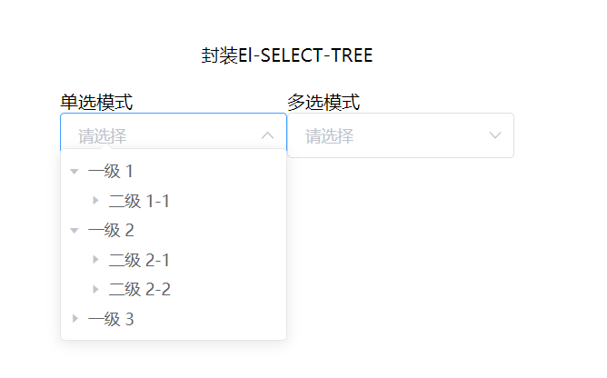
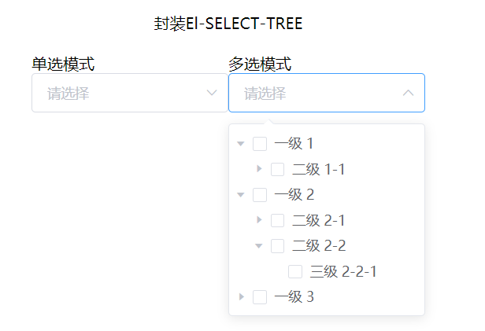

<!-- # Element-UI -->

## 1、封装 Select-Tree 组件

|  |  |
| -------------------------------------------------------------------------------- | -------------------------------------------------------------------------------- |

### 1.1、代码实现

> `el-select-tree/index.js`

```js
import SelectTree from "./select-tree.vue";

/* istanbul ignore next */
SelectTree.install = function (Vue) {
  Vue.component(SelectTree.name, SelectTree);
};

export { SelectTree };
```

> `el-select-tree/select-tree.vue`

```vue
<template>
  <el-select
    :disabled="disabled"
    :size="size"
    :clearable="clearable"
    :placeholder="placeholder"
    :no-data-text="noDataText"
    :popper-class="popperClass"
    :popper-append-to-body="popperAppendToBody"
    :multiple="multiple"
    :value="value"
    @visible-change="handleVisibleChange"
    @remove-tag="handleRemoveTag"
    @clear="handleClear"
    ref="selectRef"
  >
    <el-option
      v-if="data.length !== 0"
      value=""
      style="display: none"
    ></el-option>

    <template v-if="value">
      <el-option
        :value="item[nodeKey]"
        :label="item[props?.label ?? 'label']"
        style="display: none"
        :key="item[nodeKey] + index"
        v-for="(item, index) in optionData"
      ></el-option>
    </template>

    <el-tree
      :node-key="nodeKey"
      :props="props"
      :data="data"
      :highlight-current="highlightCurrent"
      :default-expand-all="defaultExpandAll"
      :expand-on-click-node="expandOnClickNode"
      :check-on-click-node="checkOnClickNode"
      :auto-expand-parent="autoExpandParent"
      :show-checkbox="showCheckbox"
      :check-strictly="checkStrictly"
      @check="handleCheck"
      @current-change="handleCurrentChange"
      ref="treeRef"
    ></el-tree>
  </el-select>
</template>

<script>
export default {
  name: "ElSelectTree",
  componentName: "ElSelectTree",
  model: {
    prop: "value",
    event: "update:value",
  },
  emits: ["update:value", "visible-change", "change"],

  props: {
    value: {
      type: String | Number | Array,
    },
    data: {
      type: Array,
      required: true,
      default: () => [],
    },
    disabled: {
      type: Boolean,
      default: false,
    },
    multiple: {
      type: Boolean,
      default: false,
    },
    size: {
      type: "medium" | "small" | "mini",
    },
    clearable: {
      type: Boolean,
      default: false,
    },
    placeholder: {
      type: String,
      default: "请选择",
    },
    noDataText: {
      type: String,
      default: "无数据",
    },
    popperClass: {
      type: String,
    },
    popperAppendToBody: {
      type: Boolean,
      default: true,
    },
    // tree
    nodeKey: {
      type: String,
      required: true,
    },
    props: {
      type: Object,
      default: () => {},
    },
    highlightCurrent: {
      type: Boolean,
      default: false,
    },
    defaultExpandAll: {
      type: Boolean,
      default: false,
    },
    expandOnClickNode: {
      type: Boolean,
      default: false,
    },
    checkOnClickNode: {
      type: Boolean,
      default: false,
    },
    autoExpandParent: {
      type: Boolean,
      default: false,
    },
    checkStrictly: {
      type: Boolean,
      default: false,
    },
  },

  computed: {
    showCheckbox() {
      return this.multiple;
    },
    optionData() {
      return this.flatteningTreeData.filter((item) =>
        this.value.includes(item[this.nodeKey])
      );
    },
  },

  watch: {
    value: {
      handler(val) {
        if (!this.multiple) {
          this.setCurrentNode(val);
        } else {
          this.setMultipleCurrentNode(val);
        }

        if (!val) {
          return;
        }
      },
      immediate: true,
    },

    data: {
      handler(val) {
        this.flatteningTree(val);
      },
      immediate: true,
    },
  },

  data() {
    return {
      flatteningTreeData: [],
    };
  },

  methods: {
    /**
     * 扁平化树形结构
     * @param {Array} data
     */
    flatteningTree(data) {
      data.forEach((item) => {
        const children = this.props?.children ?? "children";

        if (item[children] && item[children].length) {
          this.flatteningTree(item[children]);
        } else {
          delete item[children];
        }
        this.flatteningTreeData.push(item);
      });
    },

    handleCheck(data, { checkedKeys, halfCheckedKeys }) {
      if (this.multiple) {
        const val = [...checkedKeys, ...halfCheckedKeys];
        this.$emit("update:value", val);
        this.$emit("change", val);
      }
    },
    handleCurrentChange(data, node) {
      if (this.multiple) {
        return;
      }
      if (this.checkStrictly && data.children?.length) {
        return;
      }
      this.$emit("input", data[this.nodeKey]);
      this.$emit("change", data[this.nodeKey]);
      this.$refs.selectRef.blur();
    },

    /**
     * 单选节点选中
     * @param {String} val key
     */
    setCurrentNode(val) {
      this.$nextTick(() => {
        this.$refs.treeRef.setChecked(val);
      });
    },

    /**
     * 多选节点选中
     * @param {Array} data
     */
    setMultipleCurrentNode(data) {
      this.$nextTick(() => {
        this.$refs.treeRef.setCheckedKeys(data, this.checkStrictly);
      });
    },

    handleVisibleChange(visible) {
      if (visible) {
        this.multiple
          ? this.setMultipleCurrentNode(this.value)
          : this.setCurrentNode(this.value);
      }
      this.$emit("visible-change", visible);
    },

    handleRemoveTag(val) {
      val = this.value.filter((item) => item !== val);
      this.$emit("update:value", val);
    },

    handleClear() {
      this.$emit("update:value", undefined);
    },
  },
};
</script>
```

### 1.2、食用文档

- 在 main.js 引入 `el-select-tree/index.js`
- 使用 Vue.use(SelectTree) 挂载组件

```js
import { SelectTree } from "@/components/el-select-tree";
Vue.use(SelectTree);
```

## 2、ElScrollbar 组件

> `ElementUI`内置滚动条组件，用于替换浏览器原生滚动条。
>
> 但官网并未提及此组件。

### 2.1、食用文档

```vue
<el-scrollbar wrap-class="el-custom-wrap">
    <p>
    Lorem ipsum dolor, sit amet consectetur adipisicing elit. Delectus
    iste odio assumenda? Qui quasi consequatur quia fugit atque nam,
    maxime dolorum corporis dolore optio sit officia nulla distinctio
    placeat. Molestias? Necessitatibus incidunt officiis accusantium
    </p>
</el-scrollbar>

<style>
.el-custom-wrap {
  max-height: 137px;
}
</style>
```

> 必须给`wrap`层（包裹容器）固定的高度，可以通过`wrap-class`或`wrapStyle`配置

### 2.2、属性

| **属性名** |                                            说明                                            |          **类型**          | 默认值 |
| :--------: | :----------------------------------------------------------------------------------------: | :------------------------: | :----: |
|   native   |                                   是否使用原生滚动条样式                                   |         `boolean`          | false  |
| wrapStyle  | 包裹容器的自定义样式（不推荐使用）；<br/>示例：`:wrap-style="[{ 'max-height': '100px' }]"` | `string` / `array<object>` |   —    |
| wrapClass  |                                    包裹容器的自定义类名                                    |          `string`          |   —    |
| viewStyle  |                                      视图的自定义样式                                      |    `string` / `object`     |   —    |
| viewClass  |                                      视图的自定义类名                                      |          `string`          |   —    |
|  noresize  |            不响应容器尺寸变化，如果容器尺寸不会发生变化，最好设置它可以优化性能            |         `boolean`          | false  |
|    tag     |                                       视图的元素标签                                       |          `string`          |  div   |
