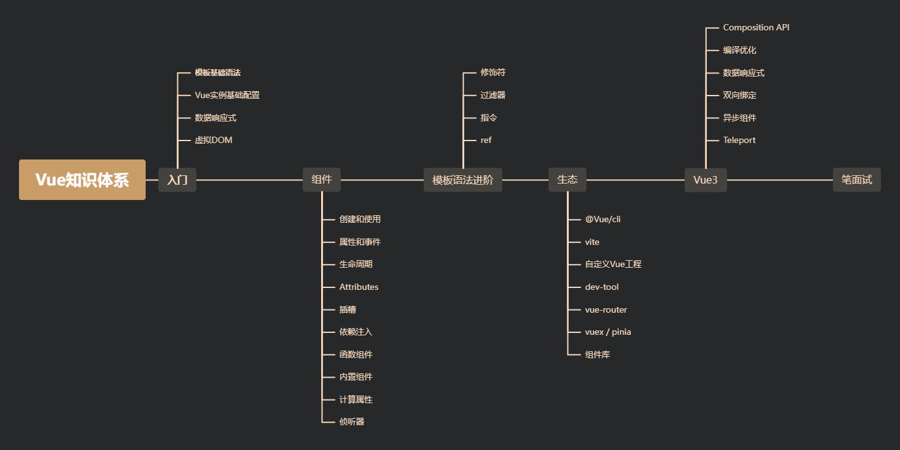
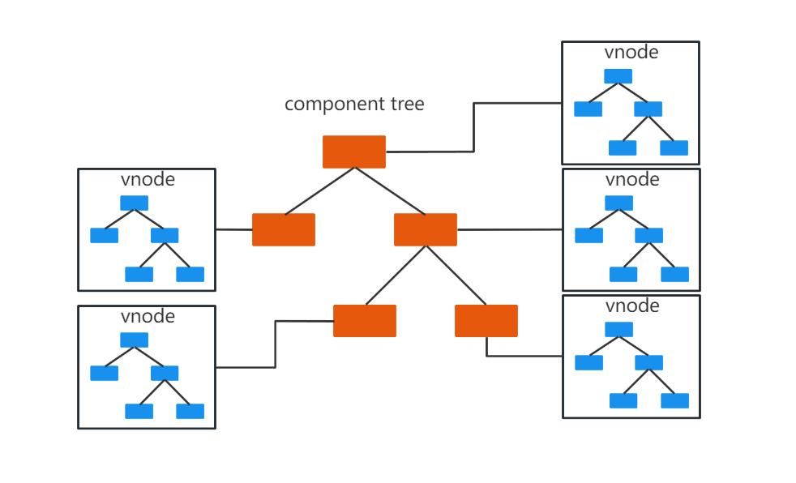

<!-- # Vue -->



## 1、自定义 ref 实现防抖

### 1.1、实现原理

1.  `vue`提供了一个自定义`ref`的入口：`customRef`；

2.  它接收一个函数作为参数，返回需要返回一个包含`get`和`set`；

3.  并且`vue`会向参数中传入两个参数`track`、`trigger`，它们都是方法；

> **track**：依赖收集
>
> **trigger**：派发更新

```javascript
function myCustomRef(value) {
  return customRef((track, trigger) => {
    return {
      get() {
        // 依赖收集
        track();
        return value;
      },
      set(val) {
        // 派发更新
        value = val;
        trigger();
      },
    };
  });
}
```

### 1.2、具体实现

**debounceRef**

```javascript
import { customRef } from "vue";

export function debounceRef(value, delay = 1000) {
  let timer;
  return customRef((track, trigger) => {
    return {
      get() {
        // 依赖收集
        track();
        return value;
      },
      set(val) {
        clearTimeout(timer);
        timer = setTimeout(() => {
          // 派发更新
          value = val;
          trigger();
        }, delay);
      },
    };
  });
}
```

### 1.3、食用文档

```vue
<script setup>
import { debounceRef } from "./utils/debounceRef";
// 默认时间
const message = debounceRef("");

// 自定义时间
const text = debounceRef("", 3000);
</script>

<template>
  <div>
    <input type="text" v-model="message" />
    <p>{{ message }}</p>

    <input type="text" v-model="text" />
    <p>{{ text }}</p>
  </div>
</template>
```

## 2、详解虚拟 DOM

### 2.1 什么是虚拟 dom？

虚拟 DOM 本质就是一个普通的 JS 对象，用于描述视图的界面结构

在 vue 中，每个组件都有一个`render`函数，每个`render`函数都会返回一个虚拟 dom 树，这也就意味着每一个组件都对应一颗虚拟 DOM 树



### 2.2 为什么需要虚拟 dom？

在`vue`中，渲染视图会调用`render`函数，这种渲染不仅发生在组件创建时，同时发生在视图依赖的数据更新时。如果在渲染时，直接使用真实 DOM，由于真实 DOM 的创建、更新、插入等操作会带来大量的性能损耗，从而就会极大的降低渲染效率。

因此，vue 在渲染时，使用虚拟 dom 来替代真实 dom，主要为解决渲染效率的。

### 2.3 虚拟 dom 是如何转化为真实 dom 的？

在一个组件实例首次被渲染时，它先生成虚拟 dom 树，然后根据虚拟 dom 树创建真实 dom，并把真实 dom 挂载到页面中合适的位置，此时，每个虚拟 dom 便会对应一个真实的 dom。

如果一个组件受到响应式数据变化的影响，需要重新渲染时，它仍然重新调用`render`函数，创建出一个新的虚拟 dom 树，用新树和旧树对比，vue 会找到最小更新量，然后更新必要的虚拟 dom 节点，最后这些更新过的虚拟节点，会去修改它们对应的真实 dom

这样一来，就保证了对真实 dom 达到最小的改动。

### 2.4 模板和虚拟 dom 的关系？

vue 框架中有一个 `compile`模块，它负责将模板转换为`render`函数，而`render`函数调用后将得到虚拟 dom。

编译的过程分为两步：

1.  将模板字符串转为 AST
2.  将 AST 转换为`render`函数

AST：抽象语法树

如果使用传统的引入方式或`vue-clie`的配置中开启了`runtimeCompiler: true`，则编译时间发生在组件第一次加载时，这称之为运行时编译。

如果是在`vue-cli`默认配置下，编译发生在打包时，这称之为模板预编译。

编译是一个极其耗费性能的操作，预编译可以有效的提高运行时的性能，而且，由于运行的时候已不需要编译，`vue-cli`在打包时会排除掉 vue 中的 compile 模块，以减少打包体积

模板的存在，仅仅是为了让开发人员更加方便的书写界面代码

**vue 最终运行的时候，需要的是 render 函数，而不是模板，因此，模板中的各种语法，在虚拟 dom 中都是不存在的，它们都会变成虚拟 dom 的配置**

## 3、Vue 样式穿透

使用`scoped`后，父组件的样式将不会渗透到子组件中

主要用途：修改 UI 组件库的默认样式

注：可以通过取消`scoped`实现，但不推荐

处于`scoped`样式中的选择器如果想要做更"深度"的选择，也即：影响到子组件

### 3.1 >>> 写法

只适用于原始`CSS`，不适用于 `Scss` 、`Sass`、`Less`等预处理器

```vue
<template>
  <div class="box">
    <el-menu></el-menu>
  </div>
</template>
<style scoped>
.box >>> .el-menu {
  color: #ffffff;
}
</style>
```

### 3.2 /deep/ 写法

既适用于`CSS`，也适用于`Sass`、`Less`等预处理器

但问题是在`Vue-Cli3`以上版本创建的项目不再被支持

```vue
<template>
  <div class="box">
    <el-menu></el-menu>
  </div>
</template>
<style scoped lang="less">
.box /deep/ .el-menu {
  color: #ffffff;
}
</style>
```

### 3.3 ::v-deep 写法

既适用于`CSS`，也适用于`Sass`、`Less`等预处理器

在`Vue-Cli3`以上版本创建的项目才也会被支持

```vue
<template>
  <div class="box">
    <el-menu></el-menu>
  </div>
</template>
<style scoped lang="less">
.box ::v-deep .el-menu {
  color: #ffffff;
}
</style>
```

### 3.4 :deep 写法

既适用于`CSS`，也适用于`Sass`、`Less`等预处理器

在某些版本`Vue`中不支持`::v-deep`，就可使用它进行替代

```vue
<template>
  <div class="box">
    <el-menu></el-menu>
  </div>
</template>
<style scoped lang="less">
.box {
  :deep .ek-menu {
    color: #ffffff;
  }
}
</style>
```

### 3.5 Vue3 深度选择器

```vue
<template>
  <div class="box">
    <el-menu></el-menu>
  </div>
</template>
<style scoped lang="less">
.box ::v-deep(.el-menu) {
  color: #ffffff;
}
/* 简写 */
.box :deep(.el-menu) {
  color: #ffffff;
}
</style>
```

---

**总结**

- `css`可以使用`>>>`，`/deep/`，`::v-deep`
- `less`和`node-sass`可以使用`/deep/`，`::v-deep`
- `dart-sass`可以使用`::v-deep`
- `vue2.7`以上版本以及包括`vue3`，应该使用`:deep()`

## 4、使用 defer 优化白屏时间

### 1. 分析

1.  页面因过量渲染重组件，导致长时间处于白屏状态，影响用户体验；
2.  原因主要是由于浏览器需要渲染的元素过多，导致主线程阻塞了大量时间；
3.  解决方案：使用 v-if，进行逐帧渲染

### 2. 具体实现

> 具体代码，请移步[defer 优化白屏](/front-end/vue3-hooks.html#_1、-defer优化白屏)

### 3. 食用文档

```vue
<!-- App.vue -->
<script setup>
import HelloWorld from "./components/HelloWorld.vue";
import { useDefer } from "./composables/useDefer.js";

const defer = useDefer();
</script>

<template>
  <div v-for="item in 10000" :key="item">
    <HelloWorld msg="Vite + Vue" v-if="defer(item)" />
  </div>
</template>

<style scoped></style>
```
