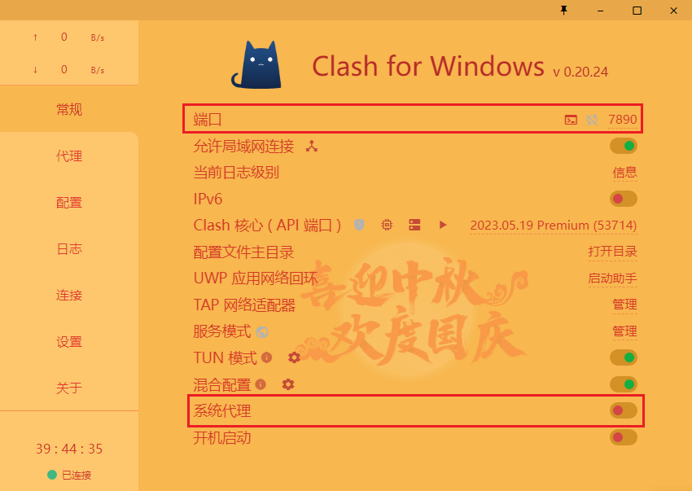
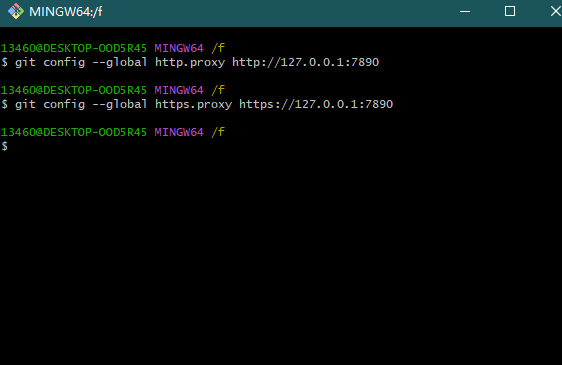
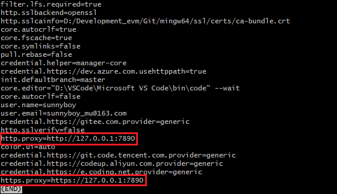

<!-- # Git -->

## 1、关联多个远程仓库

```bash
# 关联远程
git remote add 仓库名 仓库地址
# 仓库名默认为：origin

# 推送代码到该地址
git push 仓库名
```

**示例**

```bash
# 关联 Github 仓库
git remote add Github-mu https:xxxx.com

# 推送
git push Github-mu
```

**相关命令**

1.  查询当前 Git 关联的远程仓库

```bash
git remote -v
```

2.  删除远程仓库

```bash
# 删除指定
git remote remove 仓库名

# 删除全部
git remote remove
```

3.  修改仓库名

```bash
git remote rename <old-name> <new-name>

# 示例 git remote rename origin Github
```

## 2、配置代理

> 解决：开启`Clash`，但还是经常出现`git push`显示`time out`的情况

> 原因：`Git`默认还是不走代理



### 1.命令配置

```bash
git config --global http.proxy http://127.0.0.1:7890
git config --global https.proxy https://127.0.0.1:7890
```



### 2.检查配置

```bash
git config -l
```



### 3.取消配置

```
git config --global --unset http.proxy
git config --global --unset https.proxy
```

> 弊端：使用`Git`时必须开启代理，否则无法使用

## 3、常用命令

### 3.1、创建版本库

1.  初始化本地版本库

```bash
git init
```

2.  克隆远程版本库

```bash
git clone <url>
```

3.  克隆/拉取指定分支版本库

```bash
git clone -b <branch-name> <url>
```

### 3.2、Tag 标签

1.  查看标签

```bash
git tag
```

---

Windows 系统中，在英文输入法下，输入`q`退出 CMD

2.  创建标签

```bash
git tag <tag-name>
```

3.  删除标签

```bash
# 删除本地标签
git tag -d <tag-name>

# 删除远程标签
git push origin :refs/tags/<tag-name>
```

4.  推送标签

```bash
# 推送指定未提交的标签到远程仓库
git push <tag-name>

# 推送所有未提交的标签到远程仓库
git push --tags

# 推送所有标签到远程仓库
git push origin --tags

# 推送指定标签到远程仓库
git push origin <tag-name>
```

5.  切换标签

```bash
git checkout <tag-name>
```

## gitignore 规则

> `.gitignore`文件：告知 Git 哪些文件不需要添加到版本管理中

> 常用`gitignore`模板：[Github](https://github.com/github/gitignore)、[Gitee](https://gitee.com/kd_cmad/Common_gitignore)

1.  直接书写的单词

    - 直接书写的单词将同时匹配所有的文件或目录，无论位置

    - 例如：dist

2.  分隔符规则 1

    - 分隔符在开头或中间（或两者皆有）时，将以 .gitignore 文件位置出发进行匹配
    - 匹配时，可以同时匹配文件和目录
    - 例如：a/b 或 /a/b

3.  分隔符规则 2

    - 分隔符在结尾时，仅匹配目录
    - 例如：b/

4.  单个星号

    - 单个星号（\*）可以匹配任意数量的任意字符，但不能匹配分隔符
    - 例如：upload/\*.jpg

5.  两个星号

    - 两个星号（\*\*）可以匹配任意数量的任意字符，包含分隔符
    - 例如：\*_/upload/_.jpg

6.  问号

    - 问号（?）可以匹配单个字符，不包括分隔符
    - 例如：?.jpg

7.  范围

    - 范围声明可以匹配满足该范围的单个字符
    - 例如：[0-9]\*.jpg

8.  反向

    - 如果一个规则以 ! 开头，则表示对该规则取反
    - 利用该规则，可以对之前的文件（非目录）匹配结果进行去除
    - 匹配到了 upload 目录下的所有文件
    - upload/\*
    - 去除掉 upload 目录下的 .gitkeep 文件
    - !upload/.gitkeep
